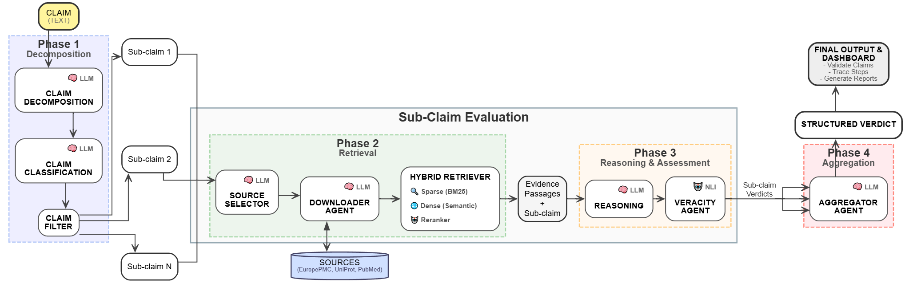
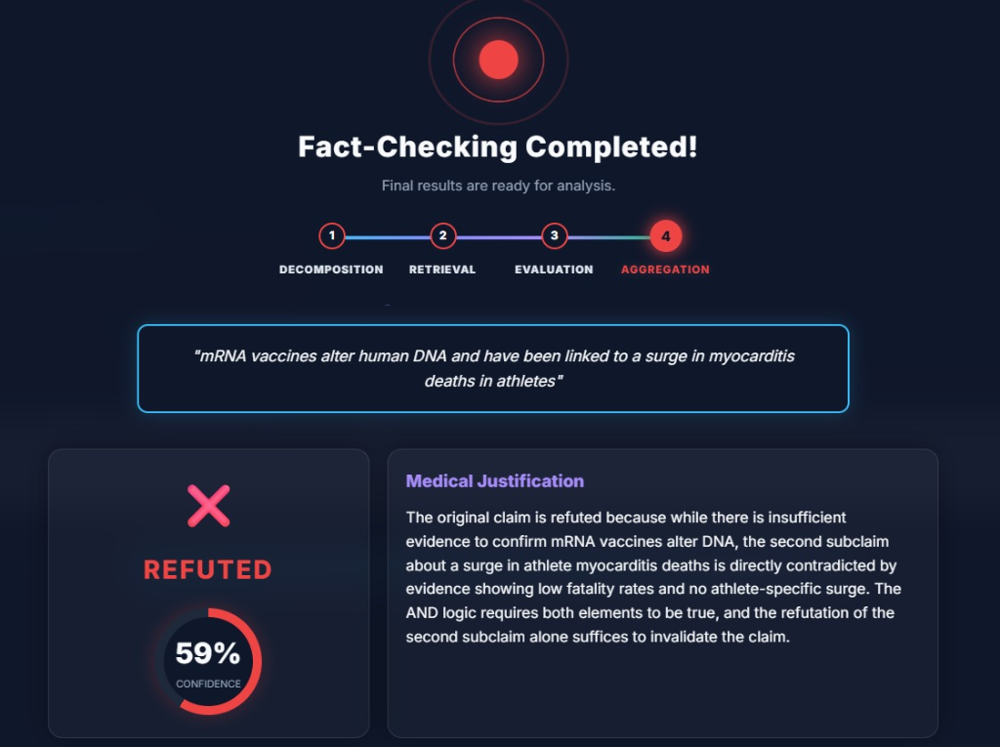

# 🧬 MedFactCheck


[](LICENSE)

---


---

**Multi-Agent AI System for Biomedical Claim Verification**

> Big Data Engineering Course — a.a. 2025-26  
> Università degli Studi di Napoli Federico II  
> Prof. Vincenzo Moscato  
> Authors: Vittoria Alberto, Davide Di Matteo, Carmine Bellotti

---

## Overview

MedFactCheck is an end-to-end multi-agent pipeline for automated biomedical fact-checking. It accepts free-text medical claims (from social media, news articles, or clinical web pages) and returns a structured verdict — **Supported**, **Refuted**, or **Not Enough Information (NEI)** — with a confidence score and traceable evidence grounded in peer-reviewed literature.

The system is orchestrated via **LangGraph** and is built around two core novelties:

1. **Extended evidence corpus** — goes beyond PubMed abstracts to include full-text articles (Europe PMC), structured biological knowledge (UniProt), and aggregated systematic reviews (PubMed Meta-Analyses).
2. **Multi-agent architecture** — specialized agents handle distinct subtasks (decomposition, retrieval, reasoning, verdict aggregation) rather than delegating everything to a single monolithic model.

---

## Architecture

The pipeline is modelled as a stateful directed graph (Super-Graph) managing a classic Map-Reduce (Fan-out / Fan-in) pattern to process complex medical claims.



---

## Key Components

### Claim Decomposition
- Splits complex, conjunctive claims into atomic, self-contained predicates using a structured JSON schema.
- Each predicate captures `relation`, `subject`, `object`, and `search_query`.
- A secondary **Classification Agent** labels each sub-claim as `verifiable`, `non-verifiable`, or `out-of-domain`.
- A deterministic **Claim Filter** discards non-medical and subjective statements.

### Evidence Retrieval
- **Europe PMC** — full-text Open Access articles via REST API.
- **UniProt** — structured biological metadata for molecular claims.
- **PubMed** — systematic reviews and meta-analyses via NCBI E-Utilities API.
- **Two-Stage Hybrid Retrieval**: BM25 sparse search + MedCPT dense search → Cross-Encoder reranking → Top-K diverse chunks.

### Reasoning & Veracity Assessment
- **Reasoning Agent** acts as a neutral extractor: verbatim quotes, entity comparison, numerical tracking — no verdicts.
- **Veracity Agent** uses a Natural Language Inference (NLI) model to classify evidence as `supported`, `refuted`, or `not_enough_information`, with a statistical confidence score.

### Verdict Aggregation
- **Aggregator LLM** applies AND/OR boolean logic over all sub-claim verdicts to produce the final compound verdict.
- Anti-hallucination constraint: the aggregator is forced to trust the NLI labels and cannot override them.

### Agent Orchestration
- Built on **LangGraph** with dynamic fan-out/fan-in for parallel sub-claim verification.
- Thread-safe state synchronization via algebraic reducers (no locking mechanisms needed).
- **LLMFactory** pattern ensures model agnosticism — switch between **NVIDIA NIM** or local **Ollama** (the currently active and fully supported providers) via `config.json`.

### Storage
- **MongoDB** (NoSQL) for node-level telemetry: every LangGraph node is instrumented with a `@log_node` decorator.
- Each log entry includes: `run_id`, `node_name`, `stage`, `subclaim`, UTC `timestamp`, and the full output payload.
- Custom recursive BSON serializer handles NumPy arrays, LangChain message objects, and applies context-aware truncation.

### Interactive Dashboard
- Built with **Streamlit** + **FastAPI** backend.
- Real-time pipeline streaming via Server-Sent Events (SSE).
- Displays claim decomposition, RAG retrieval status, per-sub-claim reasoning with color-coded verbatim quotes, and the final verdict.
- Supports PDF report export for Electronic Health Records (EHR).



---

## Models & Configuration (`config.json`)

All runtime options are managed via [config.json](file:///b:/Workspace/Unina-MSc/BIG-DATA/med-fact-check/config.json) which is loaded dynamically. Below is the mapping between configuration parameters, their JSON path, default values, and roles:

| JSON Key Path | Type | Default Value | Description |
|---|---|---|---|
| `llm.provider` | `string` | `"nvidia"` | Selected LLM provider (currently only `"nvidia"` and `"ollama"` are fully supported) |
| `llm.temperature` | `number` | `0.2` | Temperature setting for LLM token sampling |
| `llm.retries` | `integer` | `3` | Maximum retry attempts for transient API errors |
| `llm.timeout` | `integer` | `60` | Timeout in seconds for remote API model calls |
| `llm.providers.nvidia.selected_model` | `integer` | `2` | Index pointing to `"nvidia/nvidia-nemotron-nano-9b-v2"` in `available_models` |
| `retrieval.dynamic_coins` | `integer` | `5` | Maximum query budget distributed across sources per sub-claim |
| `retrieval.base_coins_per_source` | `integer` | `0` | Base query allocation granted automatically to each target source |
| `retrieval.max_results_per_query` | `integer` | `10` | Maximum documents downloaded per single query API request |
| `retrieval.downloader.max_workers` | `integer` | `8` | Maximum worker threads running parallel source fetches |
| `retrieval.max_chunks_per_subclaim` | `integer` | `300` | Upper limit of parsed chunks processed for one sub-claim before sampling |
| `retrieval.min_chunks_per_subclaim` | `integer` | `30` | Minimum threshold of retrieved chunks below which fallback steps trigger |
| `retrieval.hybrid.dense_top_k` | `integer` | `20` | Candidate chunk volume retrieved via dense search (MedCPT Bi-Encoder) |
| `retrieval.hybrid.sparse_top_k` | `integer` | `20` | Candidate chunk volume retrieved via sparse search (BM25) |
| `retrieval.hybrid.rerank_top_k` | `integer` | `8` | Final chunk selection size retained after Cross-Encoder reranking |
| `retrieval.hybrid.max_chunks_per_doc` | `integer` | `10` | Diversity filter limit mapping maximum chunks kept from any single document |
| `retrieval.chunking.chunk_size` | `integer` | `300` | Target length of text chunks in words |
| `retrieval.chunking.overlap` | `integer` | `50` | Word count overlap between consecutive text segments |
| `retrieval.dense.model_name` | `string` | `"medcpt"` | Selected dense retrieval bi-encoder model |
| `retrieval.reranker.model_name` | `string` | `"ncbi/MedCPT-Cross-Encoder"` | Selected reranker cross-encoder model |
| `evaluation.mode` | `string` | `"api"` | Execution mode for veracity classification (`"api"` or `"local"`) |
| `evaluation.veracity_model_name` | `string` | `"MoritzLaurer/deberta-v3-large-zeroshot-v1.1-all-33"` | Natural Language Inference (NLI) model used for truth validation |

---

## Project Structure

```
MED-FACT-CHECK/
├── app/
│   ├── backend/
│   │   └── main.py                  # FastAPI backend (SSE streaming endpoint)
│   └── frontend/
│       ├── components/
│       │   └── ui_components.py     # Reusable Streamlit UI components
│       ├── pages/
│       │   └── Fact_Check.py        # Main fact-checking page
│       ├── utils/
│       │   ├── pdf_generator.py     # PDF report export for EHR
│       │   └── text_processing.py   # Text utilities for the frontend
│       └── app.py                   # Streamlit entrypoint
│
├── data/
│   └── evaluation/
│       ├── datasets/
│       │   ├── bioasq_clean.csv
│       │   ├── healthfc_clean.csv
│       │   └── scifact_clean.csv
│       └── raw_datasets/
│           ├── BioASQ-train-yesno-7b.json
│           └── healthFC_annotated.csv
│
├── docs/
│   ├── reports/                     # Detailed analysis & evaluation reports
│   │   ├── [ablation_report.md](docs/reports/ablation_report.md)
│   │   ├── [aggregator_report.md](docs/reports/aggregator_report.md)
│   │   ├── [architecture_report.md](docs/reports/architecture_report.md)
│   │   ├── [benchmarking_report.md](docs/reports/benchmarking_report.md)
│   │   ├── [decomposing_team_report.md](docs/reports/decomposing_team_report.md)
│   │   ├── [dense_retrieval_report.md](docs/reports/dense_retrieval_report.md)
│   │   ├── [evaluation_team_report.md](docs/reports/evaluation_team_report.md)
│   │   ├── [future_works.md](docs/reports/future_works.md)
│   │   ├── [retrieval_team_report.md](docs/reports/retrieval_team_report.md)
│   │   └── [sparse_retrieval_report.md](docs/reports/sparse_retrieval_report.md)
│   └── schemas/                     # Architecture visualizations (gv, png, mermaid)
│       ├── [architecture.gv](docs/schemas/architecture.gv)
│       ├── [architecture.png](docs/schemas/architecture.png)
│       ├── [architecture_infographic.gv](docs/schemas/architecture_infographic.gv)
│       ├── [architecture_infographic.png](docs/schemas/architecture_infographic.png)
│       ├── [decomposition.mermaid](docs/schemas/decomposition.mermaid)
│       ├── [eval.mermaid](docs/schemas/eval.mermaid)
│       └── [retrieval.mermaid](docs/schemas/retrieval.mermaid)
│
├── evaluation/
│   ├── data_preparation/
│   │   ├── check_conflicts.py       # Duplicate/conflict detection
│   │   └── prepare_dataset.py       # Dataset preprocessing & label normalization
│   ├── results/                     # Pipeline prediction outputs (gitignored)
│   │   └── pipeline_predictions/
│   ├── final_evaluation.py          # Full-dataset evaluation script
│   ├── plot_results.py              # Visualizes accuracy/metrics trends (ablation plots)
│   └── rapid_evaluation.py          # Quick stratified-sample evaluation
│
├── img/                             # Project assets and logos
│   └── logo.png
│
├── src/
│   ├── prompts/
│   │   ├── aggregate.py             # Aggregator Agent system prompt
│   │   ├── decompose.py             # Decomposer Agent system prompt
│   │   ├── evaluate.py              # Veracity/Reasoning Agent system prompts
│   │   └── retrieve.py              # Source Selector & Query Gen. prompts
│   ├── stages/
│   │   ├── aggregator.py            # Phase 4 — Verdict Aggregation subgraph
│   │   ├── decomposing_team.py      # Phase 1 — Decomposition subgraph
│   │   ├── evaluation_team.py       # Phase 3 — Reasoning & Veracity subgraph
│   │   └── retrieval_team.py        # Phase 2 — Evidence Retrieval subgraph
│   ├── tools/retrieve/
│   │   ├── core/
│   │   │   ├── connectors/          # Europe PMC, UniProt, PubMed REST API connectors
│   │   │   │   ├── clinical_trials_api.py
│   │   │   │   ├── europe_pmc_api.py
│   │   │   │   ├── pubmed_api.py
│   │   │   │   └── uniprot_api.py
│   │   │   ├── ingestion.py         # Document ingestion & chunking
│   │   │   └── text_cleaner.py      # Noise filtering & deduplication
│   │   ├── chunking.py              # Semantic chunking strategy
│   │   ├── dense.py                 # MedCPT Bi-Encoder dense retrieval
│   │   ├── download.py              # Parallel document downloader
│   │   ├── reranker.py              # MedCPT Cross-Encoder reranking
│   │   └── sparse.py                # BM25 sparse retrieval
│   ├── utils/
│   │   ├── config.py                # Configuration loader
│   │   ├── llm_factory.py           # Model-agnostic LLM factory
│   │   ├── logger.py                # General logging utilities
│   │   └── mongo_logger.py          # @log_node decorator & MongoDB telemetry
│   ├── main_agent.py                # LangGraph Super-Graph entrypoint
│   └── state.py                     # Global pipeline state definition
│
├── test/                            # Ablation & unit tests
│   ├── data/                        # Gold validation target files
│   │   ├── aggregator_cases.json
│   │   ├── decompose_gold.json
│   │   ├── evaluation_gold.json
│   │   └── retrieval_gold.json
│   ├── reports/                     # Execution reports output (gitignored)
│   ├── interactive_decompose.py     # Interactive interface for Decomposer Agent
│   ├── interactive_retrieval.py     # Interactive interface for Retrieval Team
│   ├── test_aggregator_node.py      # Test Aggregator Agent
│   ├── test_chunking.py             # Test Chunking utility
│   ├── test_decompose_stage.py      # Test Decomposer stage
│   ├── test_evaluation_nodes.py     # Test Reasoning & Veracity Agents
│   └── test_retrieval_nodes.py      # Test Retrieval Team
│
├── .env.example                     # Environment variables template
├── config.json                      # LLM provider & hyperparameter configuration
├── docker-compose.yml               # Multi-container orchestration
├── Dockerfile                       # Container definition
└── requirements.txt                 # Python dependencies
```

---

## Evaluation

The system was benchmarked on three biomedical fact-checking datasets:

| Dataset | Description |
|---|---|
| **SciFact** | Expert-annotated scientific claims (Hugging Face: `allenai/scifact`) |
| **BioASQ** | Biomedical yes/no QA questions (PRAISELab-PicusLab CER) |
| **HealthFC** | Consumer health claims and clinical interventions (PRAISELab-PicusLab CER) |

Metrics: Accuracy, Macro-Precision, Macro-Recall, Macro-F1. For strictly binary datasets, a **binary evaluation with abstention** strategy is applied — NEI predictions are excluded from scoring and reported as the model's *Abstention Rate*.

Preliminary results on a stratified sample of 30 claims showed ~80% accuracy on BioASQ, ~60% on SciFact, and ~40% on HealthFC.

---

## Tech Stack

- **Orchestration**: LangGraph, LangChain
- **LLM Providers**: NVIDIA NIM, Ollama (fully supported and functional)
- **Retrieval**: BM25, MedCPT (HuggingFace), PyTorch (INT8 quantization)
- **NLI Classification**: DeBERTa-v3-large (HuggingFace Inference API)
- **Data Sources**: Europe PMC REST API, UniProt REST API, NCBI E-Utilities API
- **Storage**: MongoDB (PyMongo)
- **Backend**: FastAPI (SSE streaming)
- **Frontend**: Streamlit
- **Concurrency**: Python `ThreadPoolExecutor`

---

## 🚀 Deployment & Setup

You can run the complete system either using **Docker Compose** (recommended for a quick setup) or **locally** on your host machine.

### Prerequisites & Credentials

1. Clone the repository and navigate inside:
   ```bash
   git clone https://github.com/davidedm26/med-fact-check.git
   cd med-fact-check
   ```
2. Copy the environment template to create your `.env` file:
   ```bash
   cp .env.example .env
   ```
3. Edit the `.env` file and set the required API credentials:
   - `NVIDIA_API_KEY` (if using NVIDIA NIM provider) or leave empty if running local models via Ollama.
   - `HF_TOKEN` (Hugging Face token) to download embedding models.
   - `NCBI_API_KEY` (Optional PubMed API Key to increase request limits from 3 to 10 queries/sec).

---

### Option A: Containerized Deploy (Docker Compose)

This approach automatically spins up the FastAPI backend, the Streamlit frontend, and a local MongoDB instance.

1. Ensure **Docker** and **Docker Compose** (or Docker Engine) are installed and running.
2. Build and launch the containers:
   ```bash
   docker compose up --build
   ```
3. Access the interfaces:
   - 🌐 **Frontend Dashboard:** `http://localhost:8501`
   - ⚙️ **API Docs (Swagger):** `http://localhost:8000/docs`
   - 🗄️ **MongoDB Compass / Client:** Connect to `mongodb://localhost:27018` (port `27017` inside the container is mapped to host port `27018` to prevent host port collisions).

---

### Option B: Local Setup (Without Docker)

Use this method for debugging, active development, or environment tuning.

#### 1. Launch MongoDB
Ensure you have a MongoDB instance running on your machine:
- If you have MongoDB installed locally, ensure it is running on port `27017`.
- Alternatively, you can spin up a standalone MongoDB container using Docker:
  ```bash
  docker run -d -p 27018:27017 --name med-mongo mongo:latest
  ```

#### 2. Configure Environment Variables (`.env`)
Update the `MONGO_URI` variable in your `.env` file:
- For a native local MongoDB: `MONGO_URI="mongodb://localhost:27017"`
- For the Docker container mapped on `27018`: `MONGO_URI="mongodb://localhost:27018"`

#### 3. Setup Python Virtual Environment
1. Create and activate a virtual environment:
   ```bash
   python -m venv .venv
   
   # On Windows:
   .venv\Scripts\activate
   
   # On Linux / macOS:
   source .venv/bin/activate
   ```
2. **Optimize PyTorch installation** (Optional but highly recommended to avoid downloading over 2GB of unused CUDA packages):
   ```bash
   pip install --no-cache-dir torch torchvision --index-url https://download.pytorch.org/whl/cpu
   ```
3. Install the remaining requirements:
   ```bash
   pip install -r requirements.txt
   ```

#### 4. Run the Applications
To let python resolve imports from both `app` and `src`, you must run these commands with `PYTHONPATH` set to the project root directory.

##### Start the Backend (FastAPI):
- **Windows (PowerShell):**
  ```powershell
  $env:PYTHONPATH="."
  uvicorn app.backend.main:app --host 0.0.0.0 --port 8000
  ```
- **Linux / macOS (Bash):**
  ```bash
  export PYTHONPATH="."
  uvicorn app.backend.main:app --host 0.0.0.0 --port 8000
  ```

##### Start the Frontend (Streamlit):
*(Open a new terminal session, activate the virtual environment, and navigate to the project root)*
- **Windows (PowerShell):**
  ```powershell
  $env:PYTHONPATH="."
  streamlit run app/frontend/app.py --server.port=8501
  ```
- **Linux / macOS (Bash):**
  ```bash
  export PYTHONPATH="."
  streamlit run app/frontend/app.py --server.port=8501
  ```

Once running, access the Streamlit frontend at `http://localhost:8501` and the backend Swagger page at `http://localhost:8000/docs`.

---

## 📊 Running Dataset Evaluation

You can run automated benchmark evaluation sessions on the three supported datasets (**SciFact**, **BioASQ**, **HealthFC**) to compute global metrics (Accuracy, Precision, Recall, F1-Score).

All evaluation scripts must be run from the root of the project with the virtual environment activated:

### 1. Rapid Evaluation (Stratified Sample)
To run a quick evaluation on a small stratified sample (default: 30 claims) to verify pipeline integration:
- Open [evaluation/rapid_evaluation.py](file:///b:/Workspace/Unina-MSc/BIG-DATA/med-fact-check/evaluation/rapid_evaluation.py) and configure:
  - `DATASET_TO_EVALUATE`: `"scifact"`, `"bioasq"`, `"healthfc"`, or `"all"`
  - `MAX_SAMPLES`: number of claims to sample
  - `RUN_NAME`: folder name under `evaluation/results/pipeline_predictions/` where predictions will be saved
- Uncomment the call to `run_rapid_evaluation()` at the bottom of the script if you want to rerun predictions from scratch.
- Execute:
  ```bash
  python evaluation/rapid_evaluation.py
  ```

### 2. Full Benchmark Evaluation (Multi-Session with Auto-Resume)
To run a comprehensive evaluation session (default: 100 claims per dataset):
- The script automatically saves progress after **each processed claim**. If the API rate limits or you terminate execution, simply rerun the script to resume exactly where you left off.
- Execute:
  ```bash
  python evaluation/final_evaluation.py
  ```
- Detailed predictions are outputted to `evaluation/results/pipeline_predictions/final_test_1/` (gitignored), and a final metrics summary is exported to `evaluation/results/pipeline_predictions/final_evaluation_summary.csv`.

### 3. Plotting Metric Trends
To generate plots representing model benchmarking and ablation studies:
- Execute:
  ```bash
  python evaluation/plot_results.py
  ```

---

## 🧪 Running Tests

The repository contains isolated ablation and node-level tests inside the `test/` directory to evaluate specific stages of the pipeline.

### Prerequisites for Tests
Ensure you have activated your virtual environment and populated the `.env` file (tests invoke active LLM and embedding models).

### Run Test Scripts
You can run any test script directly from the root of the project:

- **Decompose Stage Ablation Test**:
  ```bash
  python test/test_decompose_stage.py
  ```
- **Evidence Retrieval Nodes Test**:
  ```bash
  python test/test_retrieval_nodes.py
  ```
- **Reasoning & Veracity Nodes Test**:
  ```bash
  python test/test_evaluation_nodes.py
  ```
- **Verdict Aggregator Node Test**:
  ```bash
  python test/test_aggregator_node.py
  ```
- **Biomedical Chunking Test**:
  ```bash
  python test/test_chunking.py
  ```

After execution, the scripts will output performance metrics and save detailed execution reports under `test/reports/`.

---

## 📄 License

This project is licensed under the MIT License - see the [LICENSE](LICENSE) file for details.

---

*Big Data Engineering Course, University of Naples Federico II | Prof. Vincenzo Moscato*
