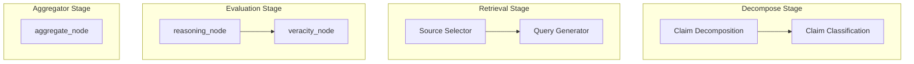

# Ablation & Component-Level Evaluation Report

This report documents the **Ablation and Component-Level Testing** infrastructure of the MedFactCheck pipeline. Ablation tests evaluate specific subgraphs and nodes in isolation against curated "gold sets," verifying individual component quality without confounding factors from other pipeline stages.

---

## 1. Testing Framework & Methodology

Ablation testing is designed to isolate stages of the pipeline to identify bottlenecks, measure prompt/model quality, and check edge cases. Each test suite runs against a specific ground-truth JSON gold set.

### Global Test Configuration
All recent ablation tests were executed with the following configuration:
* **LLM Provider**: `nvidia` (NVIDIA NIM Inference API)
* **Model**: `meta/llama-3.1-8b-instruct`
* **Temperature**: `0.2`
* **Device (Biomedical Embedder)**: CPU (utilizing the `medcpt` model for semantic query evaluation)

---

## 2. Component Ablation Breakdown

---

### A. Decomposing Team (`test_decompose_stage.py`)

* **Gold Set**: `test/data/decompose_gold.json` (24 claims annotated with expected predicates, verifiability types, and target query counts)
* **Focus**: Assesses the LLM's capacity to break complex medical claims into verifiable, atomic propositions and filter out unverifiable elements.

#### Aggregate Performance Metrics
| Metric | Value | Description |
| :--- | :--- | :--- |
| **Total Claims Tested** | 24 | Stratified test claims |
| **Predicate Count Accuracy** | 79.17% | Percentage of claims matching expected subclaim count |
| **Avg Predicate Count Delta** | 0.25 | Average difference in number of subclaims generated |
| **Avg Semantic Overlap** | 94.21% | Cosine similarity overlap of generated vs. expected queries |
| **Avg Classification Accuracy** | 100.00% | Correctly categorizing predicates as `verifiable`/`unverifiable` |
| **Avg Filter Precision** | 93.75% | Precision of selecting verifiable subclaims |
| **Avg Filter Recall** | 95.83% | Recall of selecting verifiable subclaims |
| **Over-Decomposition Rate** | 12.50% | Percentage of claims split into too many subclaims |
| **Under-Decomposition Rate** | 8.33% | Percentage of claims split into too few subclaims |

#### Insights & Observations
* **High Semantic Precision**: The `avg_semantic_overlap` (94.21%) indicates that even when the count of generated subclaims differs, the core clinical semantics of the target claim are preserved.
* **Over-Decomposition Bias**: The model tends to over-split claims containing compound subjects or multiple conditions (12.5% over-decomposition vs. 8.33% under-decomposition). This ensures high recall but can increase downstream token usage.

---

### B. Retrieval Team (`test_retrieval_nodes.py`)

* **Gold Set**: `test/data/retrieval_gold.json` (10 subclaims annotated with target database source and ideal queries)
* **Focus**: Evaluates the **Source Selector** (allocating query "coins" to `systematic_reviews`, `knowledge_base`, and `literature`) and the **Query Generator**.

#### Aggregate Performance Metrics
| Metric | Value | Description |
| :--- | :--- | :--- |
| **Total Subclaims Tested** | 10 | Target subclaims |
| **Source Selector Accuracy** | 53.33% | Accuracy of allocating budget to correct database |
| **Avg Queries Semantic Overlap** | 95.48% | Cosine similarity between generated query and gold query |

#### Insights & Observations
* **Excellent Query Generation**: The Query Generator excels at extracting clinical keywords and translating natural language claims into high-quality search terms (95.48% semantic overlap).
* **Source Selector Limitations**: The source selector accuracy stands at 53.33%. The selector sometimes confuses specialized literature (`literature`) with structured knowledge bases (`knowledge_base`) when handling basic physiological or biochemical claims (e.g., gene interactions).

---

### C. Evaluation Team (`test_evaluation_nodes.py`)

* **Gold Set**: `test/data/evaluation_gold.json` (29 evaluations with expected labels, raw evidence, and difficulty settings)
* **Focus**: Evaluates the "Reader/Judge" paradigm (`reasoning_node` + `veracity_node`). The gold set includes adversarial challenges (implicit negations, double negatives, partial relevance, numerical precision).

#### Aggregate Performance Metrics
| Metric | Value | Description |
| :--- | :--- | :--- |
| **Total Evaluations** | 29 | Challenging subclaims + evidence |
| **Label Accuracy** | 89.66% | Overall classification accuracy |
| **Avg Confidence** | 87.80% | Mean NLI model confidence |
| **Avg Confidence (Correct)** | 89.61% | Mean confidence when model classified correctly |
| **Avg Confidence (Incorrect)** | 72.15% | Mean confidence when model made an error |

#### Per-Label Accuracy Breakdown
* **Supported**: 90.91%
* **Refuted**: 100.00%
* **NEI (Not Enough Info)**: 66.67%

#### Insights & Observations
* **Robust Refutation Detection**: The model achieved 100.00% accuracy on refutations, demonstrating strong sensitivity to conflicting facts or contradictory numerical statistics (e.g., refuting "Aspirin reduces stroke risk by 50%" when evidence states 22%).
* **NEI Challenge**: Classifying `NEI` remains the most complex task (66.67% accuracy). The reasoning team sometimes struggles when evidence discusses relevant entities but lacks a causal connection (e.g., treating disjointed contexts as partially relevant rather than indicating a lack of information).
* **Calibrated Confidence**: There is a clear margin (~17.5%) between the average confidence of correct predictions (89.61%) and incorrect ones (72.15%). This delta can be used as an uncertainty flag in production.

---

### D. Aggregator Team (`test_aggregator_node.py`)

* **Gold Set**: `test/data/aggregator_cases.json` (4 complex cases representing logical combinations of subclaims)
* **Focus**: Evaluates the terminal node that aggregates multiple subclaim outcomes using logical relations (AND/OR/conditional logic).

#### Aggregate Performance Metrics
| Metric | Value | Description |
| :--- | :--- | :--- |
| **Total Cases Tested** | 4 | Diverse logical configurations |
| **Label Accuracy** | 100.00% | Correct overarching claim verdict |
| **Avg Confidence** | 63.75% | Calculated mathematical confidence |

#### Per-Label Accuracy Breakdown
* **Supported**: 100.00%
* **Refuted**: 100.00%
* **NEI**: 100.00%

#### Insights & Observations
* **Logical Rigor**: The Aggregator successfully handles logical constructs (e.g., determining that an `AND` claim is refuted if one key subclaim is refuted, or that an `OR` claim is supported if at least one treatment option is valid).

---

## 3. Conclusions and Strategic Recommendations

1. **Source Selector Calibration**: To improve the 53.33% source selection accuracy, the selector's prompt should include few-shot examples that clearly demarcate general biomedical facts (suited for the `knowledge_base`) from speculative or clinical trial results (suited for `literature`).
2. **NEI Thresholding**: Given that NEI errors have lower confidence scores (average 72.15%), a fallback rule could check if an evaluation yields a low confidence score and dynamically request the model to re-evaluate the subclaim under a stricter NEI threshold.
3. **Continuous Regression Testing**: Running these ablation tests locally during pull requests ensures that prompt modifications in one agent do not silently break accuracy metrics downstream.
