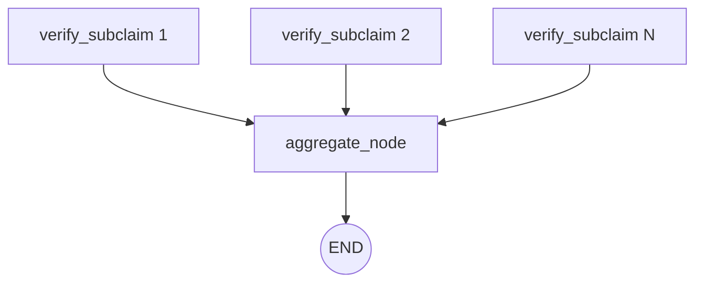

# Aggregator Team: Top-Down Architecture Report

This report analyzes the **Aggregator** node (`src/stages/aggregator.py`), the final synchronization point (Fan-In) of the MedFactCheck pipeline. It runs exactly once at the very end of the workflow, combining the isolated evaluations of individual subclaims into a single, coherent verdict for the user's original claim.

## 1. Node Topology

The Aggregator is not a complex subgraph, but a single terminal node executed after the parallel Fan-Out execution of the `verify_subclaim` workflow.

---

## 2. Node Breakdown & Logic

### `aggregate_node`
- **Agent**: `aggregator_agent` (LLM configured with structured output schema).
- **Inputs**: The user's original, complex claim and the `evaluation_results` array containing the label, confidence, and justification for every verified subclaim.
- **Action**:
  1. **Validation**: If no subclaims were generated or evaluated, it safely defaults to `not_enough_information` without calling the LLM.
  2. **LLM Aggregation**: It feeds the subclaim breakdown to the LLM, prompting it to analyze the `logical_relationship` (e.g., AND/OR logic) between the subclaims and determine the overarching `label` and `justification`.
  3. **Deterministic Confidence**: To prevent the LLM from hallucinating an arbitrary final confidence score, the mathematical confidence is calculated purely via Python logic based on the LLM's label.

---

## 3. Architectural Strengths

> [!TIP]
> **Deterministic Confidence Calculation**
> The node exhibits excellent architectural discipline by preventing the LLM from generating its own confidence score. Instead, it uses strict algorithmic logic based on the LLM's final label:
> - **If `supported`**: Averages the confidence of all `supported` subclaims (the claim is as strong as its constituent parts).
> - **If `refuted`**: Takes the **MAX** confidence of any `refuted` subclaim (because a single strong refutation of a crucial premise invalidates the entire overarching claim).
> - **Otherwise**: Averages the confidence across all subclaims.

> [!NOTE]
> **Subclaim Traceability**
> The final output dictionary includes the `subclaim_breakdown` array. This is critical for front-end integration, as it allows the UI to not only show the final "False" verdict, but also visually highlight exactly *which* part of the user's sentence was false.

## 4. Optimization Ideas & Future Work

- **Early Exit (Short-Circuit) Aggregation**: Currently, if a user submits a claim with 10 subclaims, the system waits for all 10 to be retrieved and evaluated. If subclaim #1 is immediately verified as unequivocally `refuted` (e.g., 99% confidence), a "short-circuit" mechanism could instantly halt the other 9 parallel executions and trigger the aggregator early. This would save massive amounts of API tokens and time for claims that are fundamentally false from the start.
