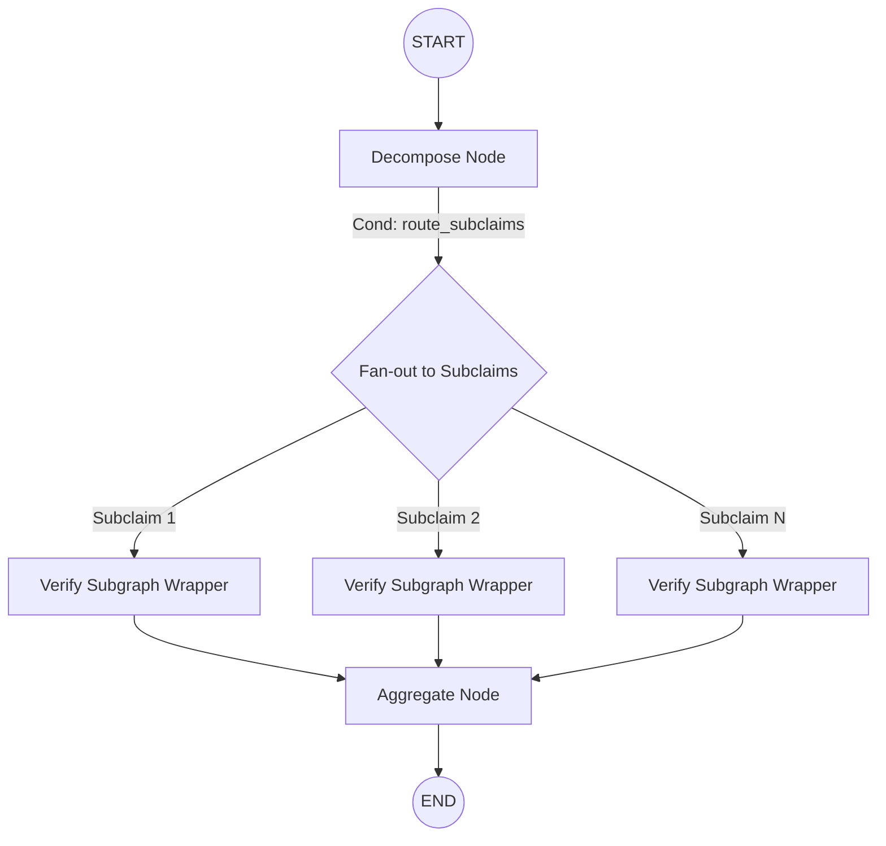

# MedFactCheck: Top-Down Architecture Report

This report provides a structural overview of the primary fact-checking pipeline managed by `FactAgent` (`src/main_agent.py`). The pipeline is orchestrated using **LangGraph** and implements a classic **Map-Reduce (Fan-out / Fan-in)** pattern to handle complex medical claims by breaking them down into atomic subclaims.

## 1. High-Level Topology (The Super Graph)

The main workflow (`super_graph`) treats the various "Teams" (Subgraphs) as black boxes, orchestrating the flow of data between them. 



### Pattern Analysis
The architecture uses a **Fan-out / Fan-in** pattern:
- **Map (Fan-out):** The `route_subclaims` conditional edge uses LangGraph's `Send` API to spawn multiple parallel instances of the `verify_subclaim` subgraph—one for each atomic subclaim extracted from the user's initial prompt.
- **Reduce (Fan-in):** The `aggregate` node acts as the synchronization point, collecting the parallel outputs from all `verify_subclaim` instances to produce the final overall verdict.

---

## 2. Main Nodes & Routing Logic

### A. `decompose`
- **Role**: Initial ingestion.
- **Action**: Invokes the `decompose_graph` (Decomposing Team) on the raw user input.
- **Output**: An array of `verifiable_subclaims`.

### B. `route_subclaims` (Conditional Router)
- **Role**: Workflow multiplexer.
- **Action**: Iterates over `verifiable_subclaims`. For each subclaim, it generates a `Send` command targeting the `verify_subclaim` node. If no subclaims are generated, it routes directly to `END`.

### C. `verify_subclaim` (The Mapping Subgraph)
- **Role**: End-to-end verification of a **single** subclaim.
- **Architecture**: This node is actually a wrapped `StateGraph` executed in isolation.
  
  ```mermaid
  graph LR
      Start((START)) --> Retrieve[retrieve]
      Retrieve --> Evaluate[evaluate]
      Evaluate --> End((END))
  ```
  
  - **`retrieve`**: Invokes the `retrieval_graph` (Retrieval Team) to source evidence for the specific subclaim.
  - **`evaluate`**: Formats the retrieved chunks into a numbered text string, then invokes the `evaluation_graph` (Evaluation Team) to generate a reasoning justification and an NLI-based veracity label (`supported`, `refuted`, `nei`).

### D. `aggregate`
- **Role**: Final synthesizer.
- **Action**: Invokes the `aggregate_node`. It merges the results of all subclaims (labels, confidence scores, justifications) to formulate the final verdict for the overarching user claim.

---

## 3. The Subgraphs (The "Teams")

The system modularizes specialized logic into distinct LangGraph subgraphs. From a top-down perspective, these are:

1. **Decomposing Team** (`stages/decomposing_team.py`):
   - Uses `decomposition_agent` and `classification_agent`.
   - Cleans the complex input claim and splits it into discrete, verifiable factual statements.

2. **Retrieval Team** (`stages/retrieval_team.py`):
   - Uses `source_selector_agent`.
   - Determines the best knowledge bases (e.g., PubMed, Clinical Trials) and executes sparse/dense retrieval algorithms to fetch evidence chunks.

3. **Evaluation Team** (`stages/evaluation_team.py`):
   - Uses `reasoning_agent` (LLM) and `veracity_node` (NLI Model).
   - Generates a clinical summary of the evidence, bypassing standard LLM hallucinations, and uses a deterministic text-classifier to output the final label and confidence score.

---

## 4. Optimization & Refactoring Considerations

As you begin your top-down optimization, consider these architectural points:

> [!TIP]
> **Parallel Execution Bottlenecks**
> The Fan-out design inherently supports parallel execution for each subclaim. However, if the `retrieval_graph` or `evaluation_graph` rely heavily on local dense embeddings or local NLI models (which we observed previously), parallelizing these nodes without a dedicated GPU will instantly throttle the CPU. Moving these to async API calls (e.g., Hugging Face Inference API) is the best way to unlock true concurrency.

> [!NOTE]
> **State Management (`state.py`)**
> Because `verify_subclaim` runs concurrently for multiple subclaims, the global `State` relies heavily on `Annotated[..., operator.add]` (reducers) to safely merge concurrent updates to lists (like `evaluation_results`). Modifying state structures requires careful attention to these reducers to avoid `InvalidUpdateError`.

> [!IMPORTANT]
> **Dynamic Routing (The Supervisor)**
> Currently, `_make_supervisor_node` exists in `main_agent.py` but is **not active** in the main workflow. The pipeline is strictly linear/hierarchical. If your optimization ideas include adding dynamic, agent-driven routing (e.g., looping back to retrieval if the evaluation team finds the evidence lacking), this unused supervisor logic will be the foundation.
