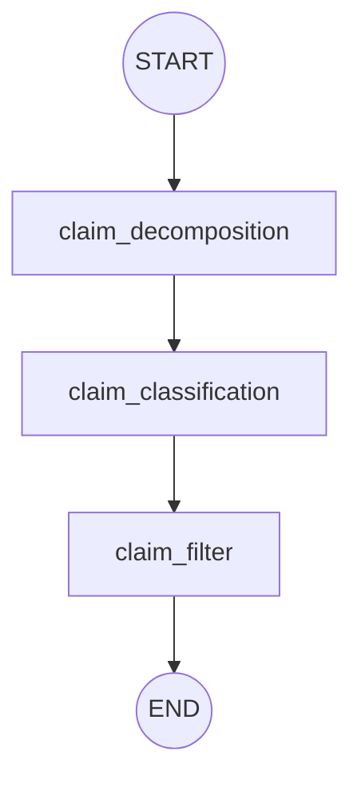

# Decomposing Team: Top-Down Architecture Report

This report analyzes the **Decomposing Team** subgraph (`src/stages/decomposing_team.py`), which acts as the entry point (ingestion layer) for the MedFactCheck pipeline. Its goal is to take complex, unstructured user claims and distill them into discrete, verifiable medical facts.

## 1. Graph Topology

Unlike the main workflow, the Decomposing Team is a strictly **sequential** pipeline. There is no dynamic routing or conditional logic—every claim flows through the same three steps.



---

## 2. Node Breakdown & Agent Logic

### A. `claim_decomposition`
- **Agent**: `decomposition_agent` (LLM with `claim_decomposition` schema)
- **Prompt Logic**: Instructs the LLM to extract BOTH factual assertions and subjective opinions, splitting compound sentences into atomic predicates. It forces coreference resolution (replacing pronouns with actual nouns) and conditional propagation (attaching "if X" to all related subclaims).
- **Output**: An array of `predicates`, where each predicate contains a `relation`, `subject`, `object`, and a natural language `search_query`.

  **Decomposition Example:**
  *"Metformin reduces the risk of cardiovascular events, but it significantly increases the risk of lactic acidosis."*
  
  ```mermaid
  graph LR
      Original["Original Claim"] --> P1["Predicate 1"]
      Original --> P2["Predicate 2"]
      
      P1 --> S1["Subject: Metformin"]
      P1 --> R1["Relation: reduces risk of"]
      P1 --> O1["Object: cardiovascular events"]
      P1 -.-> Q1[/"Query: Metformin reduces risk of cardiovascular events"/]
      
      P2 --> S2["Subject: Metformin"]
      P2 --> R2["Relation: significantly increases risk of"]
      P2 --> O2["Object: lactic acidosis"]
      P2 -.-> Q2[/"Query: Metformin significantly increases risk of lactic acidosis"/]
      
      style Original fill:#f9f,stroke:#333,stroke-width:2px
      style Q1 fill:#e1f5fe,stroke:#0288d1,stroke-dasharray: 5 5
      style Q2 fill:#e1f5fe,stroke:#0288d1,stroke-dasharray: 5 5
  ```

### B. `claim_classification`
- **Agent**: `classification_agent` (LLM with `claim_classification` schema)
- **Prompt Logic**: Acts as a strict gatekeeper. It first extracts only the natural language `search_query` from each predicate and removes duplicates to optimize the LLM call (skipping the LLM entirely if no valid queries are found). It evaluates each unique query and assigns one of three labels:
  - `verifiable`: Objective assertions related to medicine/biology.
  - `non-verifiable`: Subjective opinions, vague anecdotes, or normative statements.
  - `out-of-domain`: Verifiable facts that are not related to healthcare (e.g., tech, finance, pop culture).
- **Output**: A mapped `predicate_type_dict` containing the queries and their assigned types.

### C. `claim_filter`
- **Agent**: Pure Python logic (No LLM).
- **Action**: Iterates through the classification dictionary. It discards anything marked `non-verifiable` or `out-of-domain`, extracting only the string text of the verified queries.
- **Output**: The final array of `verifiable_subclaims` (as raw strings) that will be sent back to the Main Graph to trigger the Map-Reduce verification process.

---

## 3. Structural Vulnerabilities & Optimization Ideas

As you plan your refactoring, here are the architectural weak points and opportunities for optimization in this team:

> [!NOTE]
> **Soft Fallback Implemented**
> To prevent pipeline crashes if the `decomposition_agent` fails to produce valid JSON, a minimal "soft fallback" is now in place. Instead of looping or crashing, the node gracefully falls back to using the user's original raw claim as a single `search_query` predicate. This guarantees that the ingestion layer never blocks the execution, delegating the entire claim verification directly to the downstream nodes.

> [!TIP]
> **Agent Consolidation (Cost & Latency Reduction)**
> Currently, the pipeline makes **two separate LLM calls** in sequence (Decompose, then Classify). This doubles the latency of the ingestion phase. With powerful models like LLaMA-70B or GPT-4o, these two tasks can be merged into a single structured output schema (e.g., the LLM extracts the subclaim AND assigns the `is_verifiable` and `domain` tags in the same JSON object). This would cut ingestion time by 50%.

> [!NOTE]
> **Information Loss on Filter**
> The `claim_filter` node completely drops non-verifiable subclaims. If a user inputs *"My doctor is an idiot and he prescribed me paracetamol for cancer"*, the pipeline drops the first half entirely. While correct for fact-checking, you might want to preserve these dropped subclaims in the state to inform the final UI output (e.g., "We ignored X because it's an opinion, but we checked Y").
