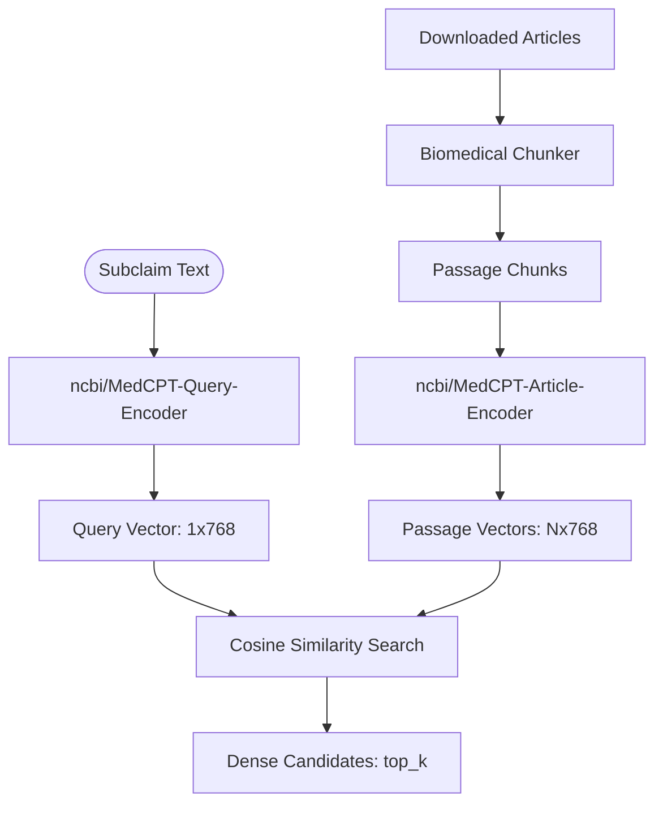

# Dense Retrieval & Semantic Similarity Report

This report provides a detailed architectural and functional analysis of the **Dense Retrieval** component in the MedFactCheck pipeline. Dense retrieval leverages pre-trained biomedical language representations to perform semantic search, allowing the system to identify conceptually relevant evidence chunks even when there is no exact keyword overlap with the claim.

---

## 1. Overview in Retrieval Flow

Within the `Retrieval Team` stage (`src/stages/retrieval_team.py`), the retrieval process adopts a hybrid approach. Dense retrieval works in tandem with sparse retrieval (BM25) to feed a downstream Cross-Encoder reranker.

---

## 2. Key Component Details

### A. Biomedical Chunking (`BiomedicalChunker`)
To extract precise context without exceeding the model's token capacity or diluting semantic information, downloaded texts are processed by the `BiomedicalChunker` (`src/tools/retrieve/chunking.py`):
- **Sentence-Level Splitting**: Uses NLTK's `sent_tokenize` (utilizing `punkt`/`punkt_tab` tokenizers) to split clinical text cleanly without breaking in the middle of sentences or abbreviations (such as dosages or acronyms).
- **Chunk Parameters**:
  - `chunk_size`: Maximum word limit per chunk (default: `300` words).
  - `overlap`: Overlap of sentences at the boundary of adjacent chunks (default: `50` words) to maintain semantic context across chunks.
- **Section Parsing**: Dynamically maps lines to clinical sections (e.g., *Abstract*, *Introduction*, *Methods*, *Results*, *Discussion*, *Conclusion*, *Summary*) and ignores reference lists to ensure only informative text is indexed.

### B. Biomedical Embedder (`BiomedicalEmbedder`)
Semantic encoding is performed by the `BiomedicalEmbedder` class (`src/tools/retrieve/dense.py`), designed around NCBI's **MedCPT**:
- **Dual-Encoder Architecture**:
  - **Query Encoder**: `ncbi/MedCPT-Query-Encoder` maps the user claim or verbose subclaim (up to 64 tokens) into a joint embedding space.
  - **Article Encoder**: `ncbi/MedCPT-Article-Encoder` encodes passage chunks (up to 256 tokens) into the same space.
- **Vector Dimension**: Both encoders produce vectors of dimension $D = 768$.
- **INT8 Dynamic Quantization**: 
  - When running on CPU, the models are dynamically quantized (`torch.quantization.quantize_dynamic`) to `qint8`.
  - This reduces the memory footprint and accelerates inference speed by nearly $2\times - 3\times$ on CPU environments without significant loss in embedding quality.
- **Hardware Acceleration**: Auto-detects and utilizes `cuda` or `mps` (Apple Silicon) if available, with a safe fallback to `cpu`.

### C. Dense Vector Store (`DenseVectorStore`)
Because the corpus is fetched dynamically per claim (live search results), indexing is performed on-the-fly:
- **Cosine Similarity Calculation**: Computes the dot product of normalized vectors:
  $$\text{Similarity}(q, p) = \vec{q} \cdot \vec{p}^T$$
  Using NumPy's matrix multiplication: `self._embeddings @ query_vec.astype("float32").T`.
- **In-Memory Store**: A lightweight Python implementation suited for dynamic query-specific context.

---

## 3. Integration in the Hybrid Pipeline

The `hybrid_retriever_node` merges and filters candidate evidence from both dense and sparse sources to balance semantic understanding and keyword recall:

1. **Dense Candidates**: Uses the **full verbose subclaim** as the query to capture deep semantic meaning, returning the top `dense_top_k` chunks (default: `20`).
2. **Sparse Candidates (BM25)**: Uses concatenated keyword queries generated by the query generator node, returning the top `sparse_top_k` chunks (default: `20`).
3. **Union & De-duplication**: The unique candidates from both steps are combined.
4. **Cross-Encoder Reranking**: The candidate union is scored using the `ncbi/MedCPT-Cross-Encoder` (`src/tools/retrieve/reranker.py`). The Cross-Encoder allows query-passage interaction at the attention level, offering higher scoring precision than Bi-Encoder cosine similarities.
5. **Diversity Constraint**: Filters out repetitive chunks from the same document. A document ID is limited to a maximum of `max_chunks_per_doc` (default: `10`) to prevent a single massive article from flooding the model's context.
6. **Final Selection**: The top `rerank_top_k` (default: `8`) chunks are selected as the final context.

---

## 4. Default Configuration Parameters

The dense retrieval behavior is controlled through the global `config.json`:

| Parameter Path | Default Value | Description |
| :--- | :--- | :--- |
| `retrieval.dense.model_name` | `"medcpt"` | Underlying embedder model architecture |
| `retrieval.chunking.chunk_size` | `300` | Maximum word count per chunk |
| `retrieval.chunking.overlap` | `50` | Sentence overlap between adjacent chunks |
| `retrieval.hybrid.dense_top_k` | `20` | Number of candidates to retrieve using dense encoder |
| `retrieval.hybrid.sparse_top_k` | `20` | Number of candidates to retrieve using BM25 |
| `retrieval.hybrid.rerank_top_k` | `8` | Number of final chunks sent to the Evaluation Team |
| `retrieval.hybrid.max_chunks_per_doc` | `10` | Maximum allowed chunks from a single document |
| `retrieval.reranker.model_name` | `"ncbi/MedCPT-Cross-Encoder"` | Cross-Encoder model name |

---

## 5. Architectural Strengths & Recommendations

### Strengths
- **Biomedical Specificity**: MedCPT is trained on PubMed search logs (millions of queries and clicks), resolving synonymy (e.g., mapping "aspirin" to "acetylsalicylic acid") and medical concepts far better than general-purpose sentence embedders.
- **Resource Optimization**: CPU execution is highly viable thanks to local INT8 dynamic quantization.
- **Hybrid Security**: Integrating sparse search acts as a fallback for exact matching of dosages, clinical codes, and specific gene names.

### Recommendations for Future Improvements
1. **Embedding Cache**: If the same chunk is processed across multiple subclaims during decomposition, caching the chunk embeddings would eliminate redundant forward passes through the `MedCPT-Article-Encoder`.
2. **GPU Reranking**: Reranking multiple candidate chunks with the Cross-Encoder is the main compute bottleneck. If a GPU is available, offloading the Cross-Encoder inference to CUDA will significantly reduce end-to-end latency.
3. **Sparse-Dense Weights Tuning**: The candidate selection currently uses equal cutoffs (`top_k = 20` for both). Quantitative benchmarks could be run to optimize the ratio of dense-to-sparse candidates based on retrieval recall.
