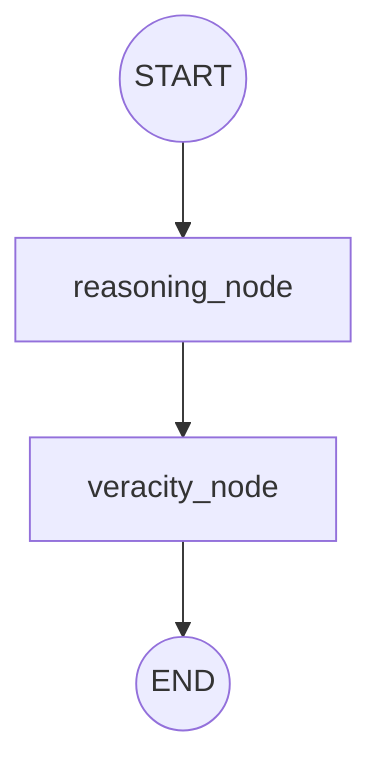

# Evaluation Team: Top-Down Architecture Report

This report analyzes the **Evaluation Team** subgraph (`src/stages/evaluation_team.py`). This subgraph is responsible for the core fact-checking logic. It takes a single atomic subclaim and its associated evidence chunks (retrieved by the Retrieval Team) and determines its veracity.

## 1. Graph Topology

The Evaluation Team operates as a strictly sequential, two-step pipeline.

---

## 2. Node Breakdown & Agent Logic

The architecture is built around a "Reader/Judge" paradigm to minimize hallucination and ensure deterministic scoring.

### A. `reasoning_node` (The Reader)
- **Agent**: `reasoning_agent` (LLM configured with `reasoning_schema`).
- **Role**: Evidence distillation and transparency. 
- **Action**: It processes noisy, raw evidence chunks alongside the target subclaim. Its job is *not* to make a final ruling, but to act as a clinical analyst: it extracts a clean summary (`distilled_evidence`) and pulls verbatim `supporting_quotes` and `refuting_quotes`.
- **Output**: A structured analytical scratchpad, effectively insulating the downstream judge from irrelevant noise and hallucination triggers.

### B. `veracity_node` (The Judge)
- **Agent**: NLI Zero-Shot Text Classifier via Hugging Face API (e.g., `DeBERTa-v3-large`).
- **Role**: Deterministic scoring and classification.
- **Action**: It formats the distilled evidence into a logical "Premise" and the subclaim into a "Hypothesis". It then queries the Hugging Face Inference API to perform Natural Language Inference (NLI).
- **Output**: 
  - `label`: Maps the NLI output strictly to `supported`, `refuted`, or `nei` (Not Enough Information).
  - `confidence`: The mathematical probability/confidence score from the classification model.
  - Appends the final assessment to the global `evaluation_results` array.

---

## 3. Architectural Strengths

> [!TIP]
> **API Offloading & Parallel Scaling**
> The `veracity_node` previously ran local NLI models, which throttled the CPU because the Main Graph spawns this Evaluation subgraph concurrently for every subclaim. Offloading this logic to the **Hugging Face Inference API** (`InferenceClient`) unlocks true concurrency and ensures smooth scaling during the Fan-Out phase.

> [!NOTE]
> **Anti-Hallucination Pipeline (Two-Step Verification)**
> By preventing the generative LLM (`reasoning_node`) from outputting the final score, and instead forcing a deterministic NLI model (`veracity_node`) to judge the LLM's distilled notes, the architecture effectively eliminates standard LLM "sycophancy" (the tendency of LLMs to agree with the user's premise regardless of the evidence).

## 4. Optimization Ideas & Future Work

Possible improvements include:
- **Dynamic Context Window Management**: If the retrieved chunks exceed the max token limit of the Inference API (which is often strict for models like DeBERTa), implementing a dynamic truncation or sliding window approach inside `veracity_node` will prevent API crashes. The `safe_truncate` function is a solid baseline, but could be enhanced with semantic chunking.
