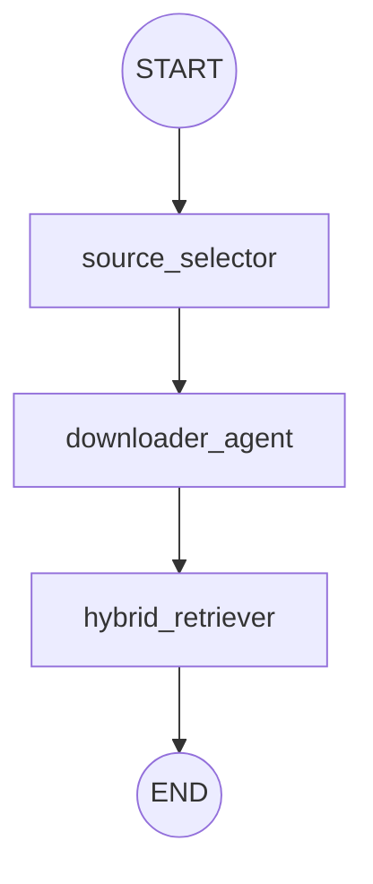

# Retrieval Team: Top-Down Architecture Report

This report analyzes the **Retrieval Team** component (`src/stages/retrieval_team.py`). This pipeline is responsible for sourcing, downloading, and ranking the best possible evidence chunks for a specific subclaim. Unlike the other teams, this logic is flattened directly into the `verify_subclaim` main workflow rather than running as an isolated subgraph.

## 1. Pipeline Topology

The retrieval process is sequential, moving from high-level source planning down to exact chunk selection.

---

## 2. Node Breakdown & Logic

### A. `source_selector_node` (The Planner)
- **Agent**: `source_selector_agent` (LLM).
- **Role**: Resource allocation.
- **Action**: It acts like a financial planner. Given a dynamic budget of "coins", it evaluates the subclaim and allocates coins to three distinct knowledge sources: `systematic_reviews`, `knowledge_base`, and `literature`. 
- **Output**: A budget dictionary dictating exactly how many parallel search queries should be spent on each source.

### B. `downloader_agent_node` (The Fetcher)
- **Agent**: `base_llm` (with structured output for query generation).
- **Role**: Query generation and concurrent downloading.
- **Action**: For every source that received coins, it invokes an LLM to generate highly specific keyword queries (one query per coin). It then uses Python's `ThreadPoolExecutor` to execute these downloads **concurrently** across all sources.
- **Resilience**: 
  - **Fallback**: If the total chunks retrieved fall below a minimum threshold (e.g., 5), it automatically triggers a fallback to the `literature` source with emergency coins.
  - **Cap**: If it retrieves too many chunks (e.g., >150), it programmatically samples them to prevent Memory/Context Overload downstream.
- **Output**: A raw, combined list of `downloaded_chunks`.

### C. `hybrid_retriever_node` (The Filter)
- **Agent**: Pure algorithmic retrieval and Machine Learning Encoders (No generative LLM).
- **Role**: Precision ranking and diversity enforcement.
- **Action**: 
  1. **Dense Retrieval**: Uses embeddings to find semantically similar chunks comparing against the full, verbose subclaim.
  2. **Sparse Retrieval (BM25)**: Uses exact keyword matching, utilizing the concentrated search queries generated in the previous step.
  3. **Cross-Encoder Reranking**: Takes the union of both retrievals and runs them through a Cross-Encoder ML model for highly accurate, contextual scoring.
  4. **Diversity Constraint**: Enforces a strict limit (e.g., `max_chunks_per_doc = 2`) to ensure the final evidence isn't biased by a single, massive document.
- **Output**: The highly curated `retrieved_chunks` array passed to the Evaluation Team.

---

## 3. Architectural Strengths

> [!TIP]
> **Concurrent I/O Operations**
> Network requests (API calls to PubMed, Clinical Trials, etc.) are the slowest operations in any pipeline. The `downloader_agent_node` excellently mitigates this by wrapping the source downloads in a `concurrent.futures.ThreadPoolExecutor`, drastically reducing wait times.

> [!NOTE]
> **Hybrid Search Strategy**
> Relying solely on Dense Embeddings often fails in the medical domain due to highly specific acronyms and dosages. Combining Dense (semantic meaning) with Sparse (exact keyword matching) and topping it off with a Cross-Encoder reranker represents the state-of-the-art in modern RAG (Retrieval-Augmented Generation) architectures.

## 4. Optimization Ideas & Future Work

- **Local Knowledge Base (Hybrid Live+Offline Retrieval)**: Implementing a curated, offline local knowledge base containing highly reliable medical literature and systematic reviews. The retrieval architecture could evolve into a true hybrid system: querying the offline vector database first for guaranteed, zero-latency evidence, and falling back to "live" external API fetching (PubMed, etc.) only when the local knowledge base lacks sufficient coverage for novel or highly specific subclaims.
