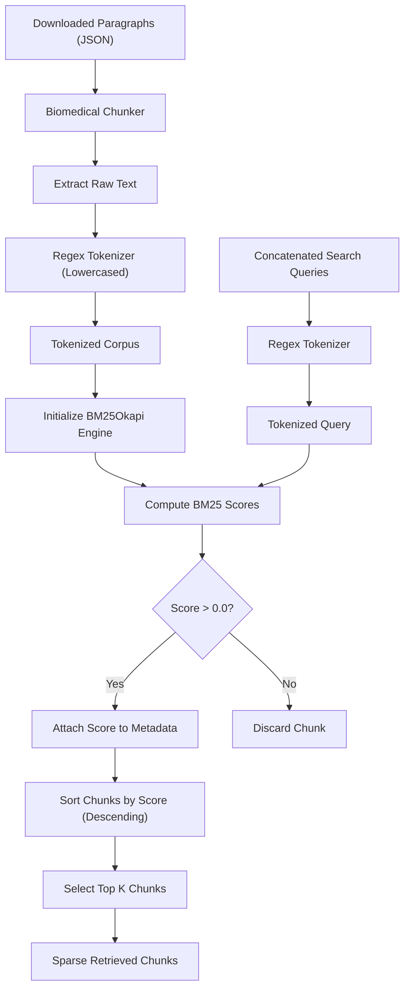
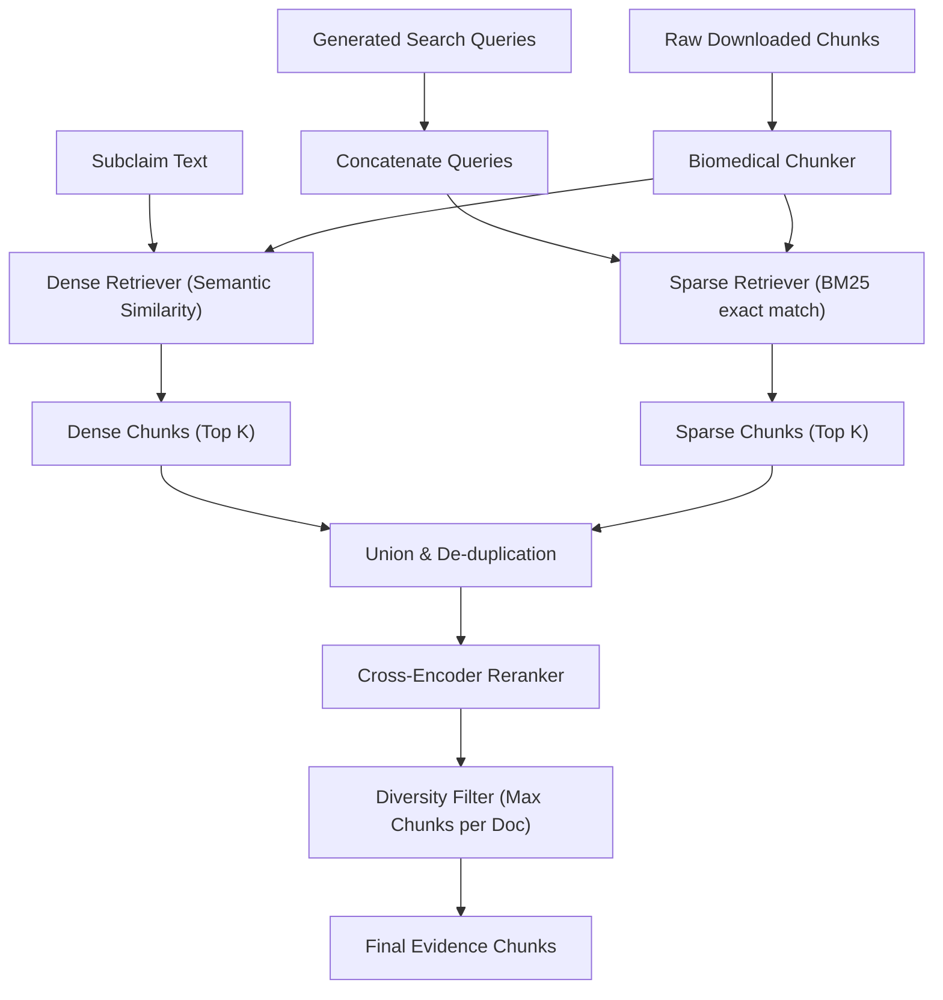

# Sparse Retrieval: Component Documentation & Architecture Report

This report provides detailed system documentation for the **Sparse Retrieval** component of the MedFactCheck pipeline. It explains the underlying algorithm, its integration within the hybrid retrieval architecture, configuration parameters, and strategic recommendations for optimization.

---

## 1. Overview and Core Algorithm

In biomedical fact-checking, precise matching of medical terminology, drug names, dosage amounts, gene identifiers, and specific acronyms is critical. While dense retrieval models are effective at capturing semantic intent, they can struggle with exact keyword validation. The **Sparse Retrieval** component addresses this by performing exact word-level matching using the **BM25 (Best Matching 25)** algorithm.

The system utilizes the [rank_bm25](https://pypi.org/project/rank-bm25/) library, specifically the `BM25Okapi` variant, implemented within the [sparse.py](file:///b:/Workspace/Unina-MSc/BIG-DATA/med-fact-check/src/tools/retrieve/sparse.py) tool.

### Algorithm Details
The BM25 score for a document $D$ given a query $Q$ (containing terms $q_1, q_2, \dots, q_n$) is computed as:

$$\text{score}(D, Q) = \sum_{i=1}^{n} \text{IDF}(q_i) \cdot \frac{f(q_i, D) \cdot (k_1 + 1)}{f(q_i, D) + k_1 \cdot \left(1 - b + b \cdot \frac{|D|}{\text{avgdl}}\right)}$$

Where:
* $f(q_i, D)$ is the term frequency of $q_i$ in document $D$.
* $|D|$ is the length of document $D$ in words.
* $\text{avgdl}$ is the average document length across the entire corpus.
* $k_1$ is a parameter controlling term frequency saturation (typically set to $1.5$ to $2.0$).
* $b$ is a parameter controlling document length normalization (typically set to $0.75$).
* $\text{IDF}(q_i)$ is the Inverse Document Frequency of term $q_i$.

---

## 2. Component Workflow

The sparse retrieval pipeline operates dynamically on the subset of documents downloaded during the execution. It tokenizes, indexes, and queries the corpus in real-time.



### Key Workflow Phases:
1. **Preprocessing & Chunking**: Incoming raw documents are chunked using the [BiomedicalChunker](file:///b:/Workspace/Unina-MSc/BIG-DATA/med-fact-check/src/tools/retrieve/chunking.py), which splits text by medical sections (e.g., *Abstract*, *Methods*, *Results*) and tokenizes sentences using NLTK to respect sentence boundaries.
2. **Tokenization**: Both the document chunks and the query are tokenized using a regular expression:
   ```python
   def tokenize_text(text: str) -> List[str]:
       return re.findall(r'\b\w+\b', text.lower())
   ```
3. **Engine Initialization**: `BM25Okapi` is initialized dynamically using the tokenized chunks.
4. **Scoring and Filtering**: Scores are calculated. Chunks with a score of `0.0` (no terms in common with the query) are discarded to prevent unrelated noise from entering downstream stages. The calculated score is appended to the chunk's metadata under `extra_info.score`.
5. **Selection**: The top-scoring chunks up to `top_k` are returned.

---

## 3. Integration into the Hybrid Retriever

Sparse retrieval does not run in isolation; it is a vital pillar of the **Hybrid Retriever** implemented in the `hybrid_retriever_node` within [retrieval_team.py](file:///b:/Workspace/Unina-MSc/BIG-DATA/med-fact-check/src/stages/retrieval_team.py).

### How the Hybrid Retriever Works:
1. **Dense Retrieval**: Runs in parallel, querying the [dense_retrieve_tool](file:///b:/Workspace/Unina-MSc/BIG-DATA/med-fact-check/src/tools/retrieve/dense.py) using the full, verbose natural language subclaim to capture semantic meaning and synonyms.
2. **Sparse Retrieval**: Queries the [sparse_retrieve_tool](file:///b:/Workspace/Unina-MSc/BIG-DATA/med-fact-check/src/tools/retrieve/sparse.py). Crucially, the sparse retriever uses a query created by **concatenating the search queries** generated by the query generator in the downloader stage:
   ```python
   sparse_query = " ".join(all_search_queries) if all_search_queries else subclaim
   ```
   > [!NOTE]
   > Keyword queries are significantly more effective for sparse matching (BM25) than full, verbose subclaim statements. This is because full natural language claims contain common conversational verbs and nouns that can dilute term frequency weights.
3. **Union & De-duplication**: The results of dense and sparse retrieval are merged. Duplicate chunks (identified by combining document ID and text preview) are resolved, ensuring each candidate chunk is evaluated only once.
4. **Reranking**: The union of chunks is sent to the Cross-Encoder model (`ncbi/MedCPT-Cross-Encoder`), which evaluates the exact semantic relationship between the subclaim and each chunk.
5. **Diversity Constraint**: Enforces a limit on the maximum number of chunks permitted from a single source document (to prevent one lengthy paper from dominating the evidence pool).



---

## 4. Configuration Parameters

The parameters governing sparse retrieval and its interaction with the hybrid pipeline are managed in [config.json](file:///b:/Workspace/Unina-MSc/BIG-DATA/med-fact-check/config.json).

| Configuration Path | Default Value | Description |
| :--- | :--- | :--- |
| `retrieval.hybrid.sparse_top_k` | `20` | The maximum number of chunks to retrieve using the sparse retrieval tool. |
| `retrieval.hybrid.dense_top_k` | `20` | The maximum number of chunks to retrieve using the dense retrieval tool. |
| `retrieval.hybrid.rerank_top_k` | `8` | The final number of chunks selected after reranking the combined union. |
| `retrieval.hybrid.max_chunks_per_doc` | `10` | The maximum chunks allowed from a single document (enforcing source diversity). |
| `retrieval.chunking.chunk_size` | `300` | Target word count for each text chunk processed by the chunker. |
| `retrieval.chunking.overlap` | `50` | Word overlap size between consecutive chunks. |

---

## 5. Strengths and Weaknesses in Medical RAG

Evaluating the architectural tradeoffs of sparse retrieval helps contextualize its performance in clinical fact-checking.

### Strengths:
* **Exact Keyword Fidelity**: Outperforms dense embeddings at locating highly specific chemical formulations (e.g., *C19H28O2*), drug names (e.g., *Dapagliflozin* vs. *Empagliflozin*), exact dosages (e.g., *500mg*), and gene designations (e.g., *ERBB2*).
* **Deterministic Behavior**: The matching is transparent and explainable. A document is selected because it contains the exact query terms, which can be directly highlighted in the user interface.
* **Low Latency & High Efficiency**: BM25 requires no GPU resources, executes in milliseconds on CPU, and does not depend on external model servers.

### Weaknesses & Mitigations:
* **Vocabulary Mismatch**: BM25 cannot recognize synonyms (e.g., matching "kidney failure" to "renal insufficiency").
  * *Mitigation*: The **Dense Retrieval** channel runs in parallel, capturing semantic synonyms.
* **No Semantic Context**: It may match words but fail to grasp the assertion's logic (e.g., matching a query about "treatment efficacy" to a document discussing "treatment failure").
  * *Mitigation*: The **Cross-Encoder Reranker** acts as a final gatekeeper, evaluating the logical context of the retrieved candidates.

---

## 6. Recommendations & Future Optimizations

To improve the efficacy of sparse retrieval within the MedFactCheck pipeline, the following enhancements are recommended:

> [!TIP]
> **Biomedical Stopword Filtering**
> The current tokenization step does not filter out standard or medical stop words (e.g., *effect*, *association*, *treatment*, *patient*). Because these words appear frequently across all medical documents, they can dilute the importance of rare terms (like drug names). Integrating a stop word filter (using NLTK or a custom medical vocabulary) prior to initializing `BM25Okapi` will improve precision.

> [!TIP]
> **Stemming and Lemmatization**
> Implementing a stemming algorithm (like the Porter Stemmer) or a biomedical lemmatizer will ensure grammatical variants (e.g., *infection*, *infected*, *infects*) match the same index key, increasing query recall.

> [!NOTE]
> **Weighted Reciprocal Rank Fusion (RRF)**
> Currently, the system takes a simple union of dense and sparse retrievals before reranking. If the cross-encoder fails or is slow, this union is unweighted. Implementing Reciprocal Rank Fusion (RRF) can merge dense and sparse rankings mathematically, providing a more robust set of candidate chunks to the reranker.
